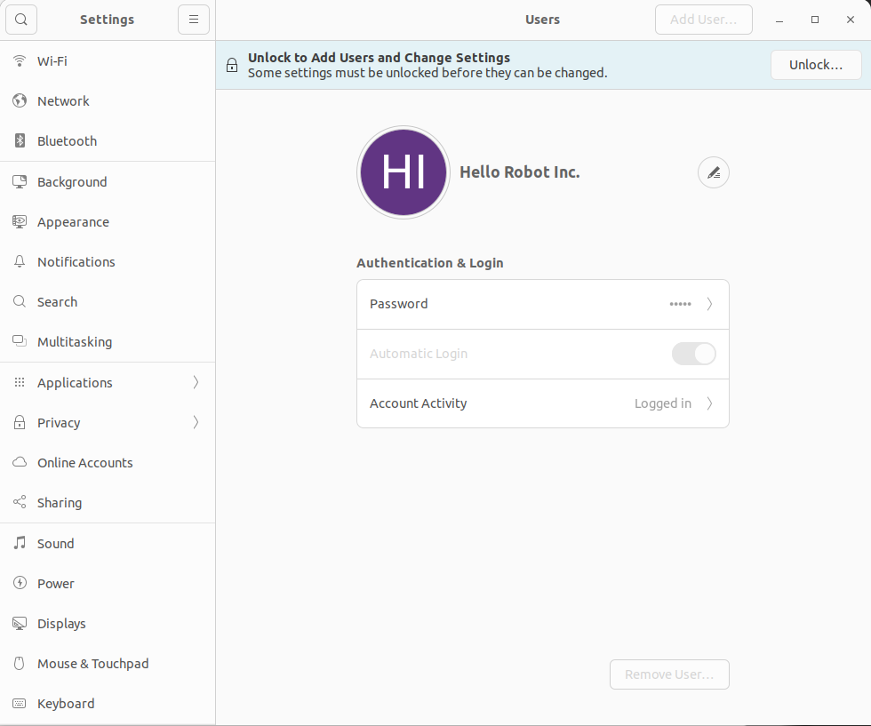
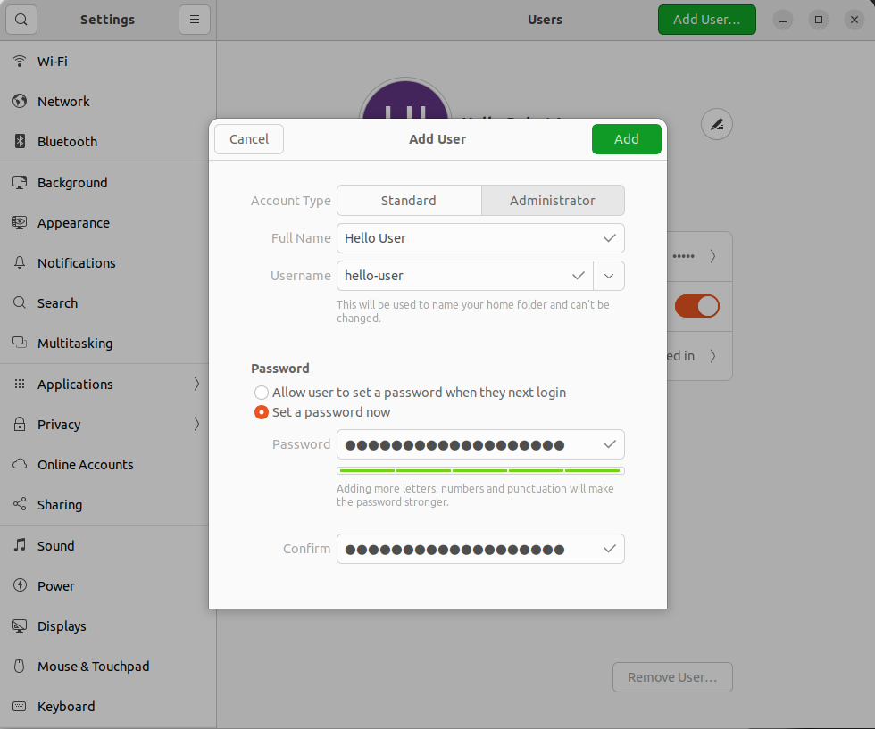

# Adding a New User

## Why

If you're sharing Stretch with other developers, it can be helpful to create separate accounts for yourself and your team members. Your code and data will be password protected in your own account, and other developers can modify their own code without accidentally affecting yours.

!!! warning

    User accounts cannot completely insulate your account from changes in another. For example, if someone attaches a new gripper or end-effector tool to the robot, your account's software would have an outdated configuration for what tool is attached to the robot. A non-exhaustive list of changes that could break/affect accounts:

      - Making hardware changes to the robot
      - Updating the firmware
      - Installing/changing [APT packages](#apt-package-manager)

## How

Start by logging into the admin Hello Robot user. Go to Users system settings and unlock adminstrator actions.



Click "Add User..." and complete the subsequent form. The new user needs to be an administrator.



Log out and back in as the new user. Open a terminal and execute the following to pull down the Stretch Install repository:

```{.bash .shell-prompt .copy}
git clone https://github.com/hello-robot/stretch_install ~/stretch_install
```

Make sure it's up-to-date:

```{.bash .shell-prompt .copy}
cd ~/stretch_install && git pull
```

Run the new user install script to set up the SDK for this new account:

```{.bash .shell-prompt .copy}
./stretch_new_user_install.sh
```

Finally, reboot the robot and run a system check in the new user account to confirm everything was set up correctly.

```bash
stretch_system_check.py
```

Your new user account is now set up successfully!

------
<div align="center"> All materials are Copyright 2020-2024 by Hello Robot Inc. Hello Robot and Stretch are registered trademarks.</div>
